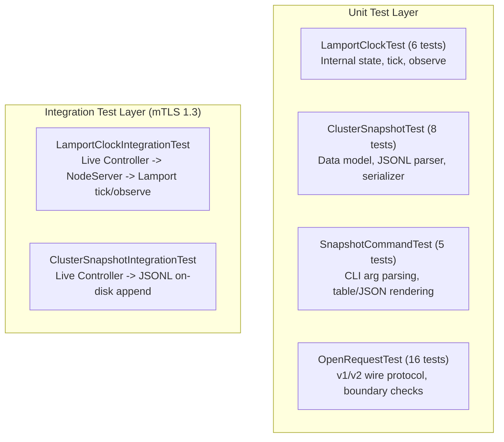
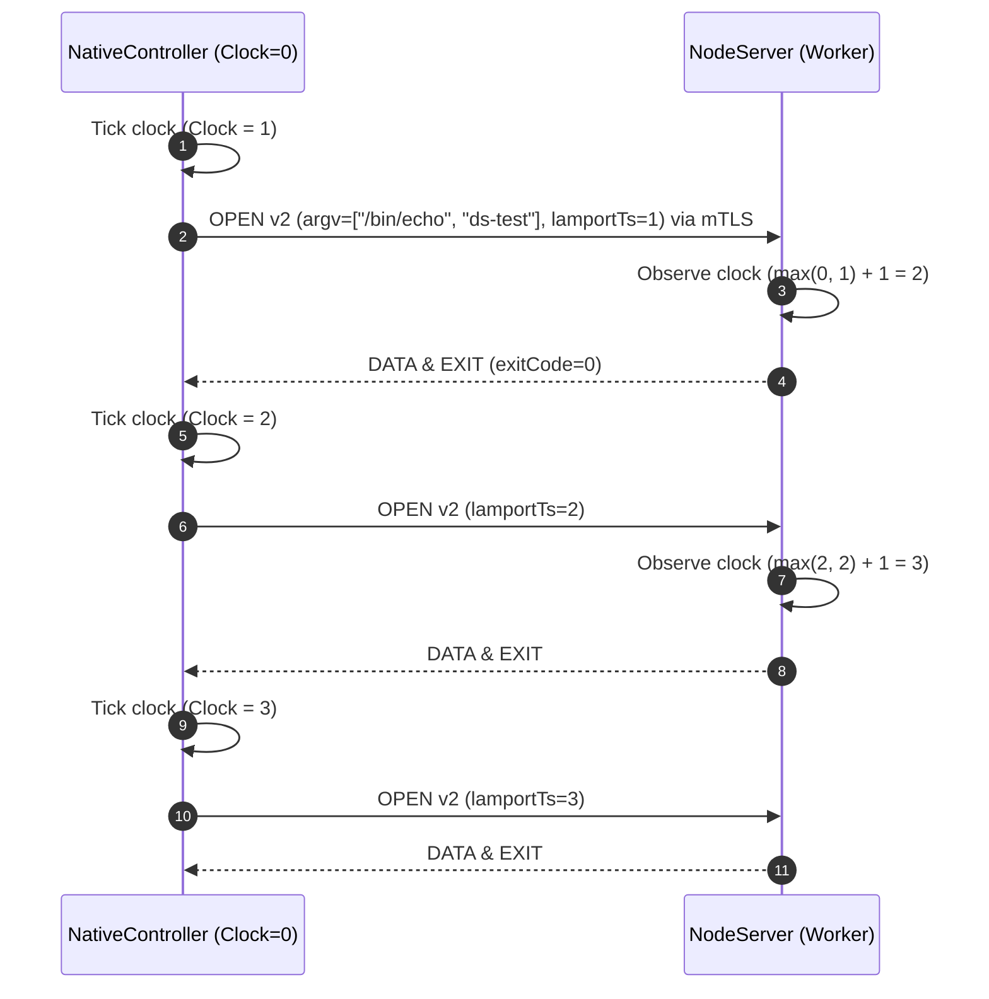
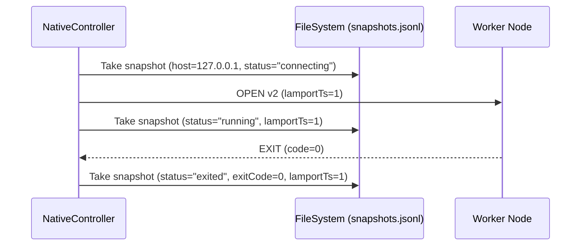

# PipeShellX Distributed Systems Testing & Verification Guide

This guide is a complete, self-contained handbook designed for students, instructors, evaluators, and engineers testing the Distributed Systems (DS) features of PipeShellX. It details how to set up the build environment, build the test binaries, run both automated and manual test suites, and understand the internal execution flow and assertions of **every single test case**.

---

## 1. Quickstart & Build Instructions

PipeShellX requires a modern C++20 compiler, CMake 3.20+, and OpenSSL 3.x with development headers. On Windows, the recommended runtime environment is **WSL2 (Ubuntu 22.04, 24.04, or 26.04)**.

### 1.1 Prerequisites Installation (Ubuntu / WSL2)

```bash
# Update package repositories
sudo apt-get update -qq

# Install C++20 compiler, build tools, and OpenSSL 3 headers
sudo apt-get install -y cmake make g++ libssl-dev
```

Verify installed tool versions:
```bash
cmake --version    # Should report CMake >= 3.20
g++ --version      # Should report GCC >= 11 (supporting C++20)
openssl version    # OpenSSL 3.x
```

### 1.2 Configuring the Build System

Configure the build inside WSL with Native Transport enabled:

```bash
# Navigate to the project root directory
cd "/mnt/c/Users/raman/Desktop/trainer module/PipeShellX"

# Configure build with native transport and release optimization
cmake -S . -B build-wsl \
    -DPIPESHELLX_NATIVE_TRANSPORT=ON \
    -DPIPESHELLX_SYSTEM_GTEST=OFF \
    -DCMAKE_BUILD_TYPE=Release
```

> [!NOTE]
> Setting `-DPIPESHELLX_SYSTEM_GTEST=OFF` instructs CMake's FetchContent to automatically download and build GoogleTest 1.14.0 into `build-wsl/_deps/`, eliminating the need for manual library management.

### 1.3 Compiling the Test Suite

Compile the test binary using all available CPU cores:

```bash
cmake --build build-wsl --target pipeshellx_tests -j$(nproc)
```

The compiled test executable will be generated at:
`build-wsl/bin/pipeshellx_tests`

---

## 2. Automated Test Execution Commands

### 2.1 Running All Distributed Systems Tests

To run all 21 DS unit and integration tests covering Lamport Clocks, Cluster Snapshots, and the Snapshot CLI:

```bash
./build-wsl/bin/pipeshellx_tests \
    --gtest_filter="*Lamport*:*ClusterSnapshot*:*SnapshotCommand*:*OpenRequest*" \
    --gtest_color=yes
```

### 2.2 Running Individual Test Suites

```bash
# 1. Lamport Clock Unit Tests (6 tests)
./build-wsl/bin/pipeshellx_tests --gtest_filter="LamportClockTest.*"

# 2. Lamport Clock End-to-End Integration Test (1 test)
./build-wsl/bin/pipeshellx_tests --gtest_filter="LamportClockIntegrationTest.*"

# 3. Cluster Snapshot Data Structure & JSONL File Tests (8 tests)
./build-wsl/bin/pipeshellx_tests --gtest_filter="ClusterSnapshotTest.*"

# 4. Cluster Snapshot Controller End-to-End Integration Test (1 test)
./build-wsl/bin/pipeshellx_tests --gtest_filter="ClusterSnapshotIntegrationTest.*"

# 5. Snapshot CLI Viewer & Formatter Tests (5 tests)
./build-wsl/bin/pipeshellx_tests --gtest_filter="SnapshotCommandTest.*"

# 6. OPEN Frame Wire Encoding & Version 2 Protocol Tests (16 tests)
./build-wsl/bin/pipeshellx_tests --gtest_filter="OpenRequestTest.*"

# 7. CLI Flag Parser Tests for --snapshot-file
./build-wsl/bin/pipeshellx_tests --gtest_filter="ParseRunTest.SnapshotFileFlagIsParsed"
```

### 2.3 Running with Verbose Output

To inspect the detailed progress and timing of every test:
```bash
./build-wsl/bin/pipeshellx_tests --gtest_filter="*Lamport*:*ClusterSnapshot*" --gtest_print_time=1
```

---

## 3. Detailed Test Case Catalog & Execution Flow

Below is the exhaustive, step-by-step execution flow for every test case in the distributed systems test suites.



---

### 3.1 `LamportClockTest` (Unit Tests)
**Source File:** [`tests/unit/runtime/test_lamport_clock.cpp`](file:///c:/Users/raman/Desktop/trainer%20module/PipeShellX/tests/unit/runtime/test_lamport_clock.cpp)  
**Target Class:** [`psx::runtime::LamportClock`](file:///c:/Users/raman/Desktop/trainer%20module/PipeShellX/include/psx/runtime/lamport_clock.hpp)

#### Test 1: `LamportClockTest.StartsAtZero`
- **DS Concept:** Initial state invariant.
- **Flow:**
  1. Instantiates a default-constructed `LamportClock clock`.
  2. Queries `clock.value()`.
- **Assertions:** `EXPECT_EQ(clock.value(), 0U)`.
- **Proof:** Ensures that a newly initialized node or controller starts its causal timeline at timestamp 0 without spurious offset.

#### Test 2: `LamportClockTest.TickIncrementsByOneAndReturnsNewValue`
- **DS Concept:** Lamport Condition C1 ($L_i = L_i + 1$ on local event).
- **Flow:**
  1. Instantiates `LamportClock clock`.
  2. Invokes `clock.tick()` three consecutive times.
- **Assertions:**
  - First tick returns `1U`.
  - Second tick returns `2U`.
  - Third tick returns `3U`.
  - Constant inspection `clock.value()` confirms internal state is `3U`.
- **Proof:** Verifies that internal process events advance the clock monotonically by 1.

#### Test 3: `LamportClockTest.ObserveTakesMaxOfLocalAndReceivedThenAddsOne`
- **DS Concept:** Lamport Condition C2 ($L_j = \max(L_j, L_i) + 1$ upon receiving message from $i$).
- **Flow:**
  1. Instantiates `clock` (local counter = 0).
  2. Simulates receiving a remote timestamp $T_{remote} = 10$. Invokes `clock.observe(10)`.
     - Calculation: $\max(0, 10) + 1 = 11$. Verified return is `11U`.
  3. Fires two local events: `clock.tick()` $\rightarrow 12$, then `clock.tick()` $\rightarrow 13$.
  4. Simulates receiving a stale remote timestamp $T_{remote} = 5 \le 13$. Invokes `clock.observe(5)`.
     - Calculation: $\max(13, 5) + 1 = 14$.
- **Assertions:** Verifies both cases where $T_{remote} > T_{local}$ and $T_{remote} \le T_{local}$.
- **Proof:** Proves the clock never moves backwards upon receiving messages from laggy or out-of-order peers.

#### Test 4: `LamportClockTest.ValueHasNoSideEffect`
- **DS Concept:** Read idempotence and immutability.
- **Flow:**
  1. Ticks clock to `1U`.
  2. Calls `clock.value()` twice in succession.
- **Assertions:** Both return values are identical (`1U`), and internal counter remains unchanged.
- **Proof:** Ensures logging or querying clock state does not pollute the causal event count.

#### Test 5: `LamportClockTest.ExplicitInitialValueIsHonoured`
- **DS Concept:** State restoration and recovery checkpointing.
- **Flow:**
  1. Instantiates `LamportClock clock(100)`.
  2. Asserts value is `100U`.
  3. Invokes `clock.tick()`.
- **Assertions:** Returns `101U`.
- **Proof:** Proves nodes resuming from saved state or snapshot checkpoints can resume their Lamport timelines accurately.

#### Test 6: `LamportClockTest.MessagePassingPreservesHappensBefore`
- **DS Concept:** Preservation of the strict happens-before relation ($A \rightarrow B \implies L(A) < L(B)$).
- **Flow:**
  1. Instantiates two independent clocks: `sender` and `receiver`.
  2. Event $A$ occurs at `sender`: `tsA = sender.tick()`.
  3. Simulates sending message over network carrying `tsA`.
  4. Event $B$ occurs at `receiver` upon arrival: `tsB = receiver.observe(tsA)`.
  5. Event $C$ occurs locally at `receiver`: `tsC = receiver.tick()`.
- **Assertions:**
  - `EXPECT_LT(tsA, tsB)` ($A \rightarrow B \implies L(A) < L(B)$).
  - `EXPECT_LT(tsB, tsC)` ($B \rightarrow C \implies L(B) < L(C)$).
- **Proof:** Proves that across separate processes, Lamport clocks establish a strict partial ordering consistent with message causality.

---

### 3.2 `LamportClockIntegrationTest` (End-to-End Test)
**Source File:** [`tests/unit/transport/test_native_transport.cpp:L1879`](file:///c:/Users/raman/Desktop/trainer%20module/PipeShellX/tests/unit/transport/test_native_transport.cpp#L1879)



#### Test: `LamportClockIntegrationTest.StageDispatchesMaintainStrictHappensBeforeOrder`
- **DS Concept:** Distributed causality across live TLS network sockets and child processes.
- **Setup:**
  1. Generates ephemeral mTLS PKI (`Fleet`) with a Certificate Authority and SAN identities (`psx://controller`, `psx://node/1`).
  2. Binds a TCP listener on `127.0.0.1` and launches an asynchronous [`NodeServer`](file:///c:/Users/raman/Desktop/trainer%20module/PipeShellX/include/psx/transport/node_server.hpp) managed by a single-threaded [`Reactor`](file:///c:/Users/raman/Desktop/trainer%20module/PipeShellX/include/psx/runtime/reactor.hpp).
  3. Creates a [`NativeController`](file:///c:/Users/raman/Desktop/trainer%20module/PipeShellX/include/psx/transport/native_controller.hpp) instance.
  4. Configures 3 target stage dispatches with serialized concurrency (`concurrency = 1`).
- **Execution:**
  1. Controller initiates sequential stage executions of `/bin/echo ds-test`.
  2. For dispatch 0: Controller ticks clock ($L=1$) and encodes `OpenRequest` with `lamportTs = 1` into an `OPEN` v2 frame.
  3. `NodeServer` parses `OPEN` v2 frame, extracts `lamportTs = 1`, and calls `NodeStageRunner::clock_.observe(1)`.
  4. Worker spawns `/bin/echo`, captures output, and transmits `DATA` and `EXIT` frames back to Controller.
  5. Controller records `HostResult` with `lamportTs = 1`.
  6. Dispatches 1 and 2 repeat this sequence, ticking the clock to 2 and 3.
- **Assertions:**
  - `results.size() == 3U`.
  - Every result completed with `ok == true` and `exitCode == 0`.
  - `results[0].lamportTs == 1U`.
  - `results[1].lamportTs == 2U`.
  - `results[2].lamportTs == 3U`.
  - `EXPECT_LT(results[0].lamportTs, results[1].lamportTs)`.
  - `EXPECT_LT(results[1].lamportTs, results[2].lamportTs)`.
- **Proof:** Directly validates over live mTLS sockets that stage dispatches form a strict, causal sequence stamped by the Lamport clock.

---

### 3.3 `ClusterSnapshotTest` (Unit Tests)
**Source File:** [`tests/unit/runtime/test_cluster_snapshot.cpp`](file:///c:/Users/raman/Desktop/trainer%20module/PipeShellX/tests/unit/runtime/test_cluster_snapshot.cpp)  
**Target Class:** [`psx::runtime::ClusterSnapshot`](file:///c:/Users/raman/Desktop/trainer%20module/PipeShellX/include/psx/runtime/cluster_snapshot.hpp)

#### Test 1: `EmptySnapshotSerializesToEmptyNodesArray`
- **DS Concept:** Snapshot frame boundary and schema consistency.
- **Flow:** Creates `ClusterSnapshot snap("run-1")` without adding nodes. Calls `snap.toJsonLine()`.
- **Assertions:** Emitted JSON contains `"type":"cluster_snapshot"`, `"run_id":"run-1"`, and `"nodes":[]`.

#### Test 2: `RecordAccumulatesInCallOrder`
- **DS Concept:** Deterministic node ordering in global state capture.
- **Flow:**
  1. Records `NodeSnapshot` for `h1` (status "running", lamportTs 3).
  2. Records `NodeSnapshot` for `h2` (status "exited", exitCode 1, lamportTs 7).
- **Assertions:**
  - `snap.nodes().size() == 2`.
  - Preserves insertion order: `h1` appears before `h2` in memory and in JSON serialization.
  - JSON output contains matching `lamport_ts: 3` and `lamport_ts: 7`.

#### Test 3: `AppendToFileWritesOneLinePerCallAndCreatesParentDirs`
- **DS Concept:** Append-only persistence and automatic parent directory creation.
- **Flow:**
  1. Sets up temporary directory with nested non-existent path `nested/snapshots.jsonl`.
  2. Appends first snapshot (`h1` "running").
  3. Appends second snapshot (`h1` "exited").
- **Assertions:**
  - Both append operations return `true`.
  - File contains exactly 2 lines. Line 1 records "running"; Line 2 records "exited".

#### Test 4: `UnwritablePathReturnsFalseWithoutThrowing`
- **DS Concept:** Failure isolation; snapshot recording failure does not crash the controller.
- **Flow:** Attempts writing to an invalid system path (`/this/path/does/not/exist/...`).
- **Assertions:** `EXPECT_FALSE(snap.appendToFile(...))` returns false without throwing an unhandled exception.

#### Test 5: `FromJsonLineRoundTripsToJsonLine`
- **DS Concept:** Lossless serialization/deserialization of distributed snapshots.
- **Flow:**
  1. Creates snapshot with 2 nodes, timestamps, and exit codes.
  2. Serializes to JSON string: `original.toJsonLine()`.
  3. Parses back via `ClusterSnapshot::fromJsonLine(line)`.
- **Assertions:** Parsed object fields (`runId`, `timestampEpochMs`, `nodes`) identically match the original object.

#### Test 6: `FromJsonLineRejectsInvalidData`
- **DS Concept:** Resilient input validation against malformed network or disk data.
- **Flow:** Tests parser against `"not json"`, `{"type":"audit_log"}`, and missing required fields.
- **Assertions:** `ClusterSnapshot::fromJsonLine(...)` returns a non-OK `psx::Result<ClusterSnapshot>`.

#### Test 7: `ReadFromFileLoadsAllSnapshots`
- **DS Concept:** State log playback and historical audit replay.
- **Flow:**
  1. Writes three sequential snapshots for a single run representing states: `connecting` $\rightarrow$ `running` $\rightarrow$ `exited`.
  2. Invokes `ClusterSnapshot::readFromFile(path)`.
- **Assertions:**
  - Result contains 3 snapshots in historical order.
  - Snapshot 3 reflects final state `exited` with `lamportTs == 5U`.

#### Test 8: `FormatTableRendersExpectedColumns`
- **DS Concept:** Human-readable distributed state visualization.
- **Flow:** Invokes `snap.formatTable()` on a multi-node snapshot.
- **Assertions:** Rendered table includes column headers `HOST`, `STAGE`, `STATUS`, `EXIT`, `LAMPORT_TS` and node IPs.

---

### 3.4 `ClusterSnapshotIntegrationTest` (End-to-End Test)
**Source File:** [`tests/unit/transport/test_native_transport.cpp:L1933`](file:///c:/Users/raman/Desktop/trainer%20module/PipeShellX/tests/unit/transport/test_native_transport.cpp#L1933)



#### Test: `ClusterSnapshotIntegrationTest.ControllerRecordsNodeSnapshotsToDisk`
- **DS Concept:** Autonomous point-in-time global state capture during live distributed execution.
- **Setup:**
  1. Creates temporary workspace with target snapshot path `snapshots.jsonl`.
  2. Configures mTLS controller and worker server.
  3. Passes `snapshotPath` and `runId = "run-snap-01"` to `NativeController::start()`.
- **Execution:**
  1. Controller connects to worker, ticks clock, sends command `/bin/echo snap-test`, and executes to completion.
  2. At each state transition, `NativeController::takeSnapshot()` queries connection states and appends a JSONL entry.
- **Assertions:**
  - `controller.captureSnapshot()` in-memory matches final state: status `exited`, exitCode `0`, `lamportTs == 1U`.
  - On-disk file `snapshots.jsonl` contains valid JSONL lines.
  - Final line reflects: `"status":"exited"`, `"exit_code":0`, `"lamport_ts":1`.
- **Proof:** Proves the controller automatically records verifiable global state snapshots to persistent storage without operator intervention.

---

### 3.5 `SnapshotCommandTest` (CLI Unit Tests)
**Source File:** [`tests/unit/cli/test_snapshot_command.cpp`](file:///c:/Users/raman/Desktop/trainer%20module/PipeShellX/tests/unit/cli/test_snapshot_command.cpp)  
**Target Function:** [`psx::cli::runSnapshotCommand`](file:///c:/Users/raman/Desktop/trainer%20module/PipeShellX/include/psx/cli/snapshot_command.hpp)

#### Test 1: `SnapshotCommandTest.EmptyArgsPrintsUsageAndReturnsUsageCode`
- **Flow:** Invokes `runSnapshotCommand({})`.
- **Assertions:** Returns exit code `2` (CLI syntax error) and outputs `"Usage: pipeshellx snapshot"`.

#### Test 2: `SnapshotCommandTest.HelpOptionPrintsUsageAndReturnsZero`
- **Flow:** Invokes `runSnapshotCommand({"--help"})`.
- **Assertions:** Returns exit code `0` and prints command-line options.

#### Test 3: `SnapshotCommandTest.NonExistentFileReportsError`
- **Flow:** Invokes `runSnapshotCommand({"/path/does/not/exist/snapshots.jsonl"})`.
- **Assertions:** Returns exit code `1` and outputs `error: failed to read snapshot file`.

#### Test 4: `SnapshotCommandTest.FormatsValidSnapshotFileAsTable`
- **Flow:** Writes a 2-node snapshot to disk and invokes `runSnapshotCommand({"dump", path})`.
- **Assertions:** Returns `0` and renders tabular output containing host names `node-alpha`, `node-beta`, and execution statuses.

#### Test 5: `SnapshotCommandTest.LatestAndJsonFlagsEmitJsonForLastSnapshot`
- **Flow:**
  1. Writes a snapshot file containing 2 historical records. Record 1: status `running`. Record 2: status `exited`.
  2. Executes `runSnapshotCommand({path, "--latest", "--json"})`.
- **Assertions:**
  - Returns `0`.
  - Emits valid JSON containing latest state: `"status":"exited"` and `"lamport_ts":3`.
  - Suppresses earlier state `"status":"running"`.
- **Proof:** Proves operator scripts can extract machine-readable latest global state via CLI.

---

### 3.6 `OpenRequestTest` (Wire Protocol Framing Tests)
**Source File:** [`tests/unit/transport/test_open_request.cpp`](file:///c:/Users/raman/Desktop/trainer%20module/PipeShellX/tests/unit/transport/test_open_request.cpp)

| Test Name | Tested Property | Assertion Verified |
|---|---|---|
| `V2RoundTripsArgvCwdAndLamportTimestamp` | v2 encode/decode | `out.value().lamportTs == 42U` preserved across wire serialization |
| `V1PayloadDecodesWithZeroLamportTimestamp` | Backward compatibility | Older v1 peer payloads decode with default `lamportTs = 0U` |
| `V2VersionByteIsTwo` | Wire frame header | First byte of `encodeOpenV2()` wire output is `0x02` |
| `V2RejectsTruncatedLamportTimestamp` | Network robustness | Truncating any of the 8 bytes of `lamportTs` causes decoder failure |
| `VersionByteIsFirst` | Protocol header | Version 1 frames start with byte `0x01` |
| `RejectsAnUnknownVersion` | Protocol negotiation | Version byte `0x03` is cleanly rejected with error |

---

## 4. Interactive Manual Testing Walkthrough

This section provides a guide to manually execute commands, generate snapshots, and inspect cluster state using the `pipeshellx` CLI tools.

### Step 1: Initialize Ephemeral Test PKI (mTLS Certificates)

```bash
# Create temporary working directory
mkdir -p /tmp/psx-demo && cd /tmp/psx-demo

# Initialize Certificate Authority and generate keys
pipeshellx ca init --dir ./pki
pipeshellx ca issue --dir ./pki --san "psx://controller" --out ./pki/controller.pem
pipeshellx ca issue --dir ./pki --san "psx://node/1" --out ./pki/node1.pem
```

### Step 2: Launch a Background Worker Node

In a separate terminal or background job:
```bash
pipeshellx node \
    --listen 127.0.0.1:9443 \
    --cert ./pki/node1.pem \
    --key ./pki/node1.key \
    --ca ./pki/ca.pem
```

### Step 3: Run Distributed Task with Snapshot Recording

Execute a cluster command across the worker while capturing global state to `snapshots.jsonl`:

```bash
pipeshellx run \
    --native \
    --target 127.0.0.1:9443 \
    --cert ./pki/controller.pem \
    --key ./pki/controller.key \
    --ca ./pki/ca.pem \
    --snapshot-file ./snapshots.jsonl \
    -- /bin/sh -c "echo 'Distributed Systems Task'; sleep 1; uname -a"
```

### Step 4: Inspect Global State Snapshots via CLI

View formatted tabular history:
```bash
pipeshellx snapshot dump ./snapshots.jsonl
```

Sample output:
```text
=== Cluster Snapshot [Run: run-1741138800000] @ 2026-09-05 03:00:00.123 UTC ===
HOST            STAGE           STATUS          EXIT    LAMPORT_TS
------------------------------------------------------------------
127.0.0.1:9443  stage-0         exited          0       1
```

View the latest snapshot in raw JSON format (for automation / jq):
```bash
pipeshellx snapshot dump ./snapshots.jsonl --latest --json
```

---

## 5. Troubleshooting & Common Pitfalls

| Symptom | Probable Cause | Resolution |
|---|---|---|
| `posix_spawn_file_actions_addchdir: symbol not found` | glibc version compatibility differences in Linux distributions | Ensure `src/os/posix/process.cpp` uses `PSX_GLIBC_AT_LEAST(2, 44)` check, falling back to `posix_spawn_file_actions_addchdir_np`. |
| `fatal error: openssl/ssl.h: No such file or directory` | Missing OpenSSL development headers | Run `sudo apt-get install -y libssl-dev`. |
| `Address already in use` during integration tests | A previous test crashed or a daemon is holding the port | Run `pkill pipeshellx` or wait for OS socket cleanup. |
| Test hang during network runs | Firewall or WSL NAT blocking loopback connections | Run test with `127.0.0.1` instead of host machine external IP. |
