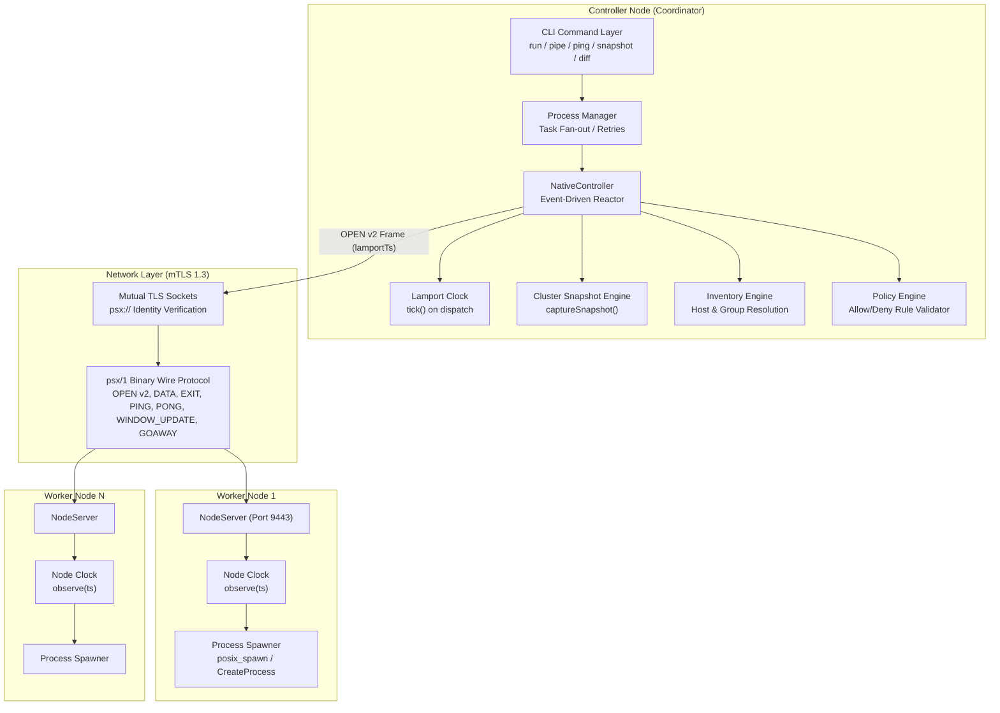
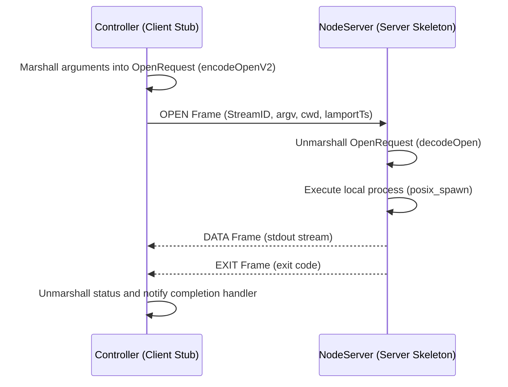

# Distributed Systems Concepts in PipeShellX — In-Depth Architectural Guide

This document presents a comprehensive, rigorous academic and systems analysis of the **Distributed Systems (DS)** concepts implemented in PipeShellX. It serves as an authoritative reference mapping the codebase against standard university distributed systems curricula (e.g., Tanenbaum & Van Steen, Coulouris et al.), structured across the four classic syllabus units.

---

## Table of Contents
1. [System Architectural Classification](#1-system-architectural-classification)
2. [Unit I: System Models, Goals & Middleware](#2-unit-i-system-models-goals--middleware)
3. [Unit II: Distributed Communication, RPC & Protocols](#3-unit-ii-distributed-communication-rpc--protocols)
4. [Unit III: Synchronization, Logical Clocks & Global State](#4-unit-iii-synchronization-logical-clocks--global-state)
5. [Unit IV: Consistency, Consensus & Emerging Paradigms](#5-unit-iv-consistency-consensus--emerging-paradigms)
6. [Comprehensive Syllabus Mapping Matrix](#6-comprehensive-syllabus-mapping-matrix)

---

## 1. System Architectural Classification

PipeShellX is an open-source, production-grade distributed shell and pipeline execution platform. Rather than simulating distributed phenomena on a single thread or relying on synthetic mocks, PipeShellX **is inherently a distributed system**.



### Architectural Models Present in PipeShellX:
1. **Master-Worker (Coordinator-Worker):** The central [`NativeController`](file:///c:/Users/raman/Desktop/trainer%20module/PipeShellX/src/transport/native_controller.cpp) acts as the coordinator responsible for dispatching commands, monitoring liveness, and recording state, while decentralized [`NodeServer`](file:///c:/Users/raman/Desktop/trainer%20module/PipeShellX/src/transport/node_server.cpp) instances act as execution workers. This mirrors production distributed systems like Google Borg, Kubernetes, and Hadoop MapReduce.
2. **Star Topology:** In the control plane, all worker nodes establish point-to-point connections with the controller.
3. **Pipeline DAG (Directed Acyclic Graph):** In stage execution mode ([`dag_runner.cpp`](file:///c:/Users/raman/Desktop/trainer%20module/PipeShellX/src/pipeline/dag_runner.cpp) and [`distributed_runner.cpp`](file:///c:/Users/raman/Desktop/trainer%20module/PipeShellX/src/pipeline/distributed_runner.cpp)), tasks form a topological execution graph where outputs of upstream workers feed downstream worker stages.

---

## 2. Unit I: System Models, Goals & Middleware

### 2.1 Characterization of a Distributed System
A distributed system consists of autonomous computing entities that communicate over a network and coordinate their actions by passing messages, appearing to users as a single coherent facility. PipeShellX satisfies all formal criteria:
- **Autonomous Nodes:** Controller and worker nodes run as distinct processes, potentially on disparate hardware, OS kernels, and geographical locations.
- **No Shared Memory:** State is never shared through raw memory pointers. All coordination occurs strictly through serialized message passing over TCP/TLS sockets.
- **Independent Failure Modes:** The failure or network partition of an individual worker node does not cause the controller to abort other executions unless explicitly requested via failure policies.
- **Concurrency:** Dispatches to multiple worker nodes execute concurrently on distinct physical CPUs.

### 2.2 Distributed Systems Goals & Transparencies
PipeShellX explicitly implements the core DS goals defined by ISO/IEC 10746 (RM-ODP):

| Goal / Transparency | Theoretical Definition | PipeShellX Implementation | Source Code |
|---|---|---|---|
| **Location Transparency** | Clients access resources without knowledge of physical location | Nodes are addressed using logical hostnames, groups, or tags in the inventory rather than hardcoded IP addresses. | [`inventory.cpp`](file:///c:/Users/raman/Desktop/trainer%20module/PipeShellX/src/inventory/inventory.cpp) |
| **Access Transparency** | Identical syntax and operations regardless of whether execution is local or remote | The `pipeshellx run` CLI offers the same invocation flags whether targeting a local worker or remote native transport nodes. | [`run_command.cpp`](file:///c:/Users/raman/Desktop/trainer%20module/PipeShellX/src/cli/run_command.cpp) |
| **Failure Transparency** | Masking faults from users | Connection retries (`--retries N`), idempotent execution guards (`--idempotent`), and failover recovery hide transient drops. | [`process_manager.cpp`](file:///c:/Users/raman/Desktop/trainer%20module/PipeShellX/src/process_manager.cpp) |
| **Concurrency Transparency** | Multiple tasks execute without mutual interference | Single-threaded event-driven reactor manages bounded concurrent connections (`-c N`) with distinct stream IDs. | [`reactor.cpp`](file:///c:/Users/raman/Desktop/trainer%20module/PipeShellX/src/runtime/reactor.cpp) |
| **Heterogeneity Support** | Interoperability across differing OS and hardware architectures | Clean abstraction shims for POSIX (Linux, macOS) and Windows NT API. | [`src/os/`](file:///c:/Users/raman/Desktop/trainer%20module/PipeShellX/src/os) |
| **Openness** | Extensibility through published, standard interfaces | Formal specification of the `psx/1` binary wire protocol and versioned message framing. | [`docs/wire_protocol.md`](file:///c:/Users/raman/Desktop/trainer%20module/PipeShellX/docs/wire_protocol.md) |
| **Scalability** | Handling increased load without degradation | Credit-based flow control, ring buffers with configurable drop policies, and non-blocking I/O backends (`epoll`, `kqueue`, `poll`). | [`credit_window.cpp`](file:///c:/Users/raman/Desktop/trainer%20module/PipeShellX/src/stream/credit_window.cpp) |

### 2.3 The Middleware Layer
PipeShellX operates as classical **systems middleware**. It abstracts low-level socket lifecycles, TLS 1.3 handshake negotiation, data marshalling, and OS process spawning behind high-level cluster coordination primitives.

---

## 3. Unit II: Distributed Communication, RPC & Protocols

### 3.1 Layered Binary Wire Protocol (`psx/1`)
Communication between controller and nodes conforms to the `psx/1` binary application protocol. All transmissions are formatted into structured Type-Length-Value (TLV) frames.

#### Frame Layout (10-Byte Header)
```text
 0                   1                   2                   3
 0 1 2 3 4 5 6 7 8 9 0 1 2 3 4 5 6 7 8 9 0 1 2 3 4 5 6 7 8 9 0 1
+-+-+-+-+-+-+-+-+-+-+-+-+-+-+-+-+-+-+-+-+-+-+-+-+-+-+-+-+-+-+-+-+
|          Magic (0x5053)       |   Version (1) |   Frame Type  |
+-+-+-+-+-+-+-+-+-+-+-+-+-+-+-+-+-+-+-+-+-+-+-+-+-+-+-+-+-+-+-+-+
|                           Stream ID                           |
+-+-+-+-+-+-+-+-+-+-+-+-+-+-+-+-+-+-+-+-+-+-+-+-+-+-+-+-+-+-+-+-+
|         Payload Length        |          Payload Data         |
+-+-+-+-+-+-+-+-+-+-+-+-+-+-+-+-+               ...             +
```

#### Protocol Frame Types
1. **`OPEN` (Type 1):** Initiates remote stage execution. Carries command `argv`, `cwd`, and in **v2**, the `lamportTs`.
2. **`DATA` (Type 2):** Streams chunks of `stdout` or `stderr` output back to the controller.
3. **`WINDOW_UPDATE` (Type 3):** Grants credit allowances for flow control.
4. **`EXIT` (Type 4):** Signals completion of a stage along with the process exit code.
5. **`PING` (Type 5):** Heartbeat probe issued by the controller to verify worker responsiveness.
6. **`PONG` (Type 6):** Liveness confirmation echoed by the worker.
7. **`GOAWAY` (Type 7):** Graceful connection teardown frame.

### 3.2 Remote Procedure Call (RPC) Pattern
PipeShellX implements the Remote Procedure Call paradigm over its message-oriented wire format:



- **Client Stub:** Implemented in [`NativeController::launch()`](file:///c:/Users/raman/Desktop/trainer%20module/PipeShellX/src/transport/native_controller.cpp#L214). It packages execution parameters, serializes them via [`encodeOpenV2()`](file:///c:/Users/raman/Desktop/trainer%20module/PipeShellX/src/transport/open_request.cpp), and transmits the frame.
- **Server Skeleton:** Implemented in [`NodeStageRunner::onOpen()`](file:///c:/Users/raman/Desktop/trainer%20module/PipeShellX/src/transport/node_stage_runner.cpp#L44). It decodes the payload, validates constraints, and executes the target process.
- **Invocation Semantics:**
  - **At-Most-Once:** Default behavior; commands are not blindly retried upon network drops to avoid non-idempotent side effects.
  - **At-Least-Once:** Enabled via `--retries N --idempotent` flags when commands are known to be idempotent.

### 3.3 Stream-Oriented Communication & Flow Control
To prevent fast worker nodes from exhausting the controller's memory buffer, PipeShellX uses **credit-based sliding window flow control** similar to HTTP/2 and QUIC:
- Each stream maintains a [`CreditWindow`](file:///c:/Users/raman/Desktop/trainer%20module/PipeShellX/include/psx/stream/credit_window.hpp).
- Senders may only transmit `DATA` bytes up to their current available credit balance.
- As the receiver consumes data, it transmits `WINDOW_UPDATE` frames replenishing sender credit.
- Buffers utilize bounded ring buffers with explicit overflow policies: `Block`, `DropOldest`, or `DropNewest`.

### 3.4 Fault Tolerance & Failure Detection
- **Liveness Probing (Heartbeats):** Schedulers issue periodic `PING` frames. Failure to receive a corresponding `PONG` within the deadline triggers connection tear-down.
- **Connection Fencing:** Detects and closes dead sockets, preventing "zombie" workers from holding controller resources.
- **Fail-Fast Policy:** When `--fail-fast` is passed, the first node that reports a non-zero exit code or network fault causes the controller to immediately issue cancellation signals to all other in-flight stages.
- **Canary Deployments:** Via `--canary N`, execution tests a small subset of nodes first. Only upon verified success is the rollout dispatched to the remainder of the cluster.

### 3.5 Distributed Security Architecture
Distributed systems are vulnerable to eavesdropping, tampering, and impersonation. PipeShellX establishes a zero-trust network boundary using:
- **Mutual TLS 1.3 (mTLS):** Both controller and worker present X.509 certificates during handshake.
- **Subject Alternative Name (SAN) Identity Verification:** Nodes reject any controller whose certificate does not present URI SAN `psx://controller`; controllers verify worker certificates against SAN `psx://node/<id>`.
- **Policy Enforcement:** An independent policy engine ([`src/policy/`](file:///c:/Users/raman/Desktop/trainer%20module/PipeShellX/src/policy)) inspects commands against administrative allow/deny lists before dispatch.

---

## 4. Unit III: Synchronization, Logical Clocks & Global State

This is the primary area of recent algorithmic additions in PipeShellX, implementing core synchronization theory.

### 4.1 The Problem of Physical Time in Distributed Systems
In a distributed environment, every machine possesses an independent physical crystal oscillator. These clocks suffer from **physical clock drift** ($\rho$), causing discrepancies of several milliseconds to seconds. Network Time Protocol (NTP) synchronizes clocks but introduces network jitter and non-monotonic backward clock adjustments. 

Because physical time cannot guarantee causality, Leslie Lamport demonstrated in 1978 that distributed systems must rely on **logical time** to establish a causal happens-before order.

### 4.2 Lamport's Logical Clocks
**Class:** [`psx::runtime::LamportClock`](file:///c:/Users/raman/Desktop/trainer%20module/PipeShellX/include/psx/runtime/lamport_clock.hpp)

#### Theoretical Formulation
The happens-before relation (denoted as $\rightarrow$) is defined by three rules:
1. If events $a$ and $b$ occur within the same process, and $a$ occurs before $b$, then $a \rightarrow b$.
2. If event $a$ is the sending of a message by one process and event $b$ is the receipt of that message by another process, then $a \rightarrow b$.
3. If $a \rightarrow b$ and $b \rightarrow c$, then $a \rightarrow c$ (transitivity).

Lamport's Logical Clock assigns a monotonically increasing scalar timestamp $L(e)$ to every event $e$ such that:
$$a \rightarrow b \implies L(a) < L(b)$$

#### Algorithm Rules (Lamport 1978)
1. **Clock Condition 1 (Local Event):** Before process $P_i$ executes a local event:
   $$L_i = L_i + 1$$
2. **Clock Condition 2 (Message Send):** When process $P_i$ sends message $m$, it increments $L_i$ and piggybacks $L_i$ onto $m$:
   $$L_i = L_i + 1, \quad m.\text{timestamp} = L_i$$
3. **Clock Condition 3 (Message Receive):** Upon receiving message $m$ with timestamp $T_m$, process $P_j$ updates its clock:
   $$L_j = \max(L_j, T_m) + 1$$

#### PipeShellX Implementation Details
1. **`LamportClock` Class:**
   ```cpp
   class LamportClock {
   public:
       std::uint64_t tick() noexcept { return ++counter_; }
       std::uint64_t observe(std::uint64_t received) noexcept {
           counter_ = std::max(counter_, received) + 1;
           return counter_;
       }
       std::uint64_t value() const noexcept { return counter_; }
   private:
       std::uint64_t counter_ = 0;
   };
   ```
2. **Controller Dispatch Sequence:**
   Before dispatching any stage, [`NativeController::launch()`](file:///c:/Users/raman/Desktop/trainer%20module/PipeShellX/src/transport/native_controller.cpp#L221) executes:
   ```cpp
   const std::uint64_t lamportTs = clock_.tick();
   req.lamportTs = lamportTs;
   ```
3. **Wire Format Piggybacking (`OPEN` v2):**
   [`encodeOpenV2()`](file:///c:/Users/raman/Desktop/trainer%20module/PipeShellX/src/transport/open_request.cpp) serializes `lamportTs` as an 8-byte big-endian unsigned integer at the end of the `OPEN` payload.
4. **Worker Arrival & Advance:**
   Upon receiving the frame, [`NodeStageRunner::onOpen()`](file:///c:/Users/raman/Desktop/trainer%20module/PipeShellX/src/transport/node_stage_runner.cpp#L49) synchronizes:
   ```cpp
   if (req.lamportTs != 0) {
       clock_.observe(req.lamportTs);
   }
   ```
5. **Total Order Extension:**
   Lamport clocks produce a partial order (concurrent events may share timestamps). PipeShellX extends this to a **strict total order** $\prec$ by using the node's unique host identity as a tiebreaker:
   $$e_i \prec e_j \iff L(e_i) < L(e_j) \lor (L(e_i) == L(e_j) \land \text{host}_i < \text{host}_j)$$

---

### 4.3 Global State & Consistent Snapshots (Chandy-Lamport)
**Class:** [`psx::runtime::ClusterSnapshot`](file:///c:/Users/raman/Desktop/trainer%20module/PipeShellX/include/psx/runtime/cluster_snapshot.hpp)  
**Implementation:** [`src/runtime/cluster_snapshot.cpp`](file:///c:/Users/raman/Desktop/trainer%20module/PipeShellX/src/runtime/cluster_snapshot.cpp)

#### The Distributed Snapshot Problem
A global state of a distributed system consists of the local states of all processes and the states of all communication channels. The fundamental challenge (solved by Chandy and Lamport in 1985) is recording a **consistent global state (consistent cut)** without freezing the entire system.

A cut $C$ is consistent if and only if for all events $e, e'$:
$$(e \in C \land e' \rightarrow e) \implies e' \in C$$
That is, if an event is in the snapshot, all events that causally preceded it must also be in the snapshot. No message can be recorded as received if it was not also recorded as sent.

#### PipeShellX's Simplified Chandy-Lamport in Star Topology
In PipeShellX, worker nodes do not communicate peer-to-peer; all execution channels terminate at the controller. In a star topology where all message flows are mediated by the coordinator, the full distributed marker-passing algorithm simplifies elegantly:
1. The coordinator acts as the centralized snapshot initiator and observer.
2. Because TCP/TLS channels guarantee FIFO ordering and credit flow control bounds in-flight messages, channel state reduces to in-flight RPC requests managed by the controller's connection tables.
3. Every state transition (dispatch, stage completion, node exit) triggers [`NativeController::takeSnapshot()`](file:///c:/Users/raman/Desktop/trainer%20module/PipeShellX/src/transport/native_controller.cpp#L271).

#### Snapshot Data Structure
Each node's captured state is represented by a [`NodeSnapshot`](file:///c:/Users/raman/Desktop/trainer%20module/PipeShellX/include/psx/runtime/cluster_snapshot.hpp#L21):
```cpp
struct NodeSnapshot {
    std::string host;          // Node network identifier
    std::string stageId;       // Current stage assigned
    std::string status;        // "connecting", "running", "exited", "failed"
    int exitCode = -1;         // Process return code (-1 while running)
    std::uint64_t lamportTs = 0; // Lamport timestamp associated with current state
};
```

#### JSONL Persistent Log Format
Snapshots are recorded as append-only, newline-delimited JSON (JSONL):
```json
{"type":"cluster_snapshot","run_id":"run-20260905","timestamp_ms":1741138800123,"nodes":[{"host":"10.0.0.1","stage_id":"stage-0","status":"exited","exit_code":0,"lamport_ts":1},{"host":"10.0.0.2","stage_id":"stage-1","status":"running","exit_code":-1,"lamport_ts":2}]}
```

#### CLI State Inspection
The dedicated CLI command [`pipeshellx snapshot dump`](file:///c:/Users/raman/Desktop/trainer%20module/PipeShellX/src/cli/snapshot_command.cpp) allows operators to visualize snapshots as structured tables or query the latest state with `--latest --json`.

---

### 4.4 Leader Election Algorithms (Bully Algorithm Design)
**Design Document:** [`docs/ds-project/03-election-stretch.md`](file:///c:/Users/raman/Desktop/trainer%20module/PipeShellX/docs/ds-project/03-election-stretch.md)

To eliminate the single point of failure in the coordinator, PipeShellX specifies a **Bully Election Algorithm** (Garcia-Molina 1982) for multi-controller high availability:
- **Election Trigger:** If a backup controller detects missing heartbeats from the primary coordinator, it initiates an election.
- **Priority:** Controllers possess unique priority IDs. A controller sends `ELECTION` frames to all controllers with higher priority IDs.
- **Bully Mechanics:** If no higher-priority peer responds with `ANSWER` within a timeout, the initiating controller assumes leadership and broadcasts `COORDINATOR` frames to all nodes.

---

## 5. Unit IV: Consistency, Consensus & Emerging Paradigms

### 5.1 Distributed Consistency Models
PipeShellX distinguishes between state consistency and execution consistency:
- **Eventual Consistency:** Applied to background state propagation and snapshot logging.
- **Output Consensus (Strict Majority Agreement):** Applied to redundant task execution.

### 5.2 Byzantine Drift Detection & Majority Consensus
**Source File:** [`src/sink/consensus_sink.cpp`](file:///c:/Users/raman/Desktop/trainer%20module/PipeShellX/src/sink/consensus_sink.cpp) and [`src/cli/diff_command.cpp`](file:///c:/Users/raman/Desktop/trainer%20module/PipeShellX/src/cli/diff_command.cpp)

In mission-critical deployments, identical commands can be dispatched across $N$ redundant nodes using the `--consensus` flag:
1. Each node runs the command independently and streams stdout back.
2. The [`ConsensusSink`](file:///c:/Users/raman/Desktop/trainer%20module/PipeShellX/include/psx/sink/consensus_sink.hpp) computes cryptographic hashes of the output streams.
3. It performs a **majority voting algorithm**:
   - If a quorum ($\lfloor N/2 \rfloor + 1$) agrees on identical output, that output is emitted as canonical.
   - Any node that deviates in output or exit code is flagged as experiencing **configuration drift or Byzantine failure**.

### 5.3 Causal & Ordered Delivery
**Source File:** [`src/sink/ordered_sink.cpp`](file:///c:/Users/raman/Desktop/trainer%20module/PipeShellX/src/sink/ordered_sink.cpp)

When multiple worker nodes emit interleaved output lines across asynchronous sockets, printing them raw results in scrambled text. The `--ordered` flag routes all incoming chunks through an [`OrderedSink`](file:///c:/Users/raman/Desktop/trainer%20module/PipeShellX/include/psx/sink/ordered_sink.hpp), which reconstructs a globally deterministic sequence matching stage invocation order.

### 5.4 Auditability & Tamper-Evident Logging
**Source File:** [`src/audit/audit_log.cpp`](file:///c:/Users/raman/Desktop/trainer%20module/PipeShellX/src/audit/audit_log.cpp)

Reflecting distributed ledger principles, every operation, certificate validation, and command execution generates a structured, append-only audit event. These entries form an immutable forensic log verifying compliance across the cluster.

---

## 6. Comprehensive Syllabus Mapping Matrix

| Syllabus Unit | Standard Syllabus Concept | PipeShellX Implementation / Feature | Primary Code References | Status |
|---|---|---|---|---|
| **Unit I** | Distributed System Definition | Multi-process, distinct address spaces, network coordination | [`docs/architecture.md`](file:///c:/Users/raman/Desktop/trainer%20module/PipeShellX/docs/architecture.md) | ✅ Built-in |
| **Unit I** | DS Goals & Transparencies | Location, failure, access transparencies; inventory resolution | [`src/inventory/inventory.cpp`](file:///c:/Users/raman/Desktop/trainer%20module/PipeShellX/src/inventory/inventory.cpp) | ✅ Built-in |
| **Unit I** | System Architectures | Master-Worker coordinator, Star topology, Pipeline DAG | [`src/pipeline/dag_runner.cpp`](file:///c:/Users/raman/Desktop/trainer%20module/PipeShellX/src/pipeline/dag_runner.cpp) | ✅ Built-in |
| **Unit I** | Middleware Concept | Event reactor, transport framing, process spawning shims | [`src/runtime/reactor.cpp`](file:///c:/Users/raman/Desktop/trainer%20module/PipeShellX/src/runtime/reactor.cpp) | ✅ Built-in |
| **Unit II** | Communication & Protocols | `psx/1` binary wire protocol, 10-byte TLV framing | [`src/transport/frame_codec.cpp`](file:///c:/Users/raman/Desktop/trainer%20module/PipeShellX/src/transport/frame_codec.cpp) | ✅ Built-in |
| **Unit II** | Remote Procedure Call (RPC) | `OPEN` (call) $\rightarrow$ `EXIT` (return), serialization stubs | [`src/transport/open_request.cpp`](file:///c:/Users/raman/Desktop/trainer%20module/PipeShellX/src/transport/open_request.cpp) | ✅ Built-in |
| **Unit II** | Stream Communication & Flow | Multiplexed `StreamId`, credit-based flow control, ring buffers | [`src/stream/credit_window.cpp`](file:///c:/Users/raman/Desktop/trainer%20module/PipeShellX/src/stream/credit_window.cpp) | ✅ Built-in |
| **Unit II** | Fault Tolerance & Heartbeats | PING/PONG liveness probing, timeouts, fail-fast, canary | [`src/transport/canary_controller.cpp`](file:///c:/Users/raman/Desktop/trainer%20module/PipeShellX/src/transport/canary_controller.cpp) | ✅ Built-in |
| **Unit II** | Distributed Security | mTLS 1.3, X.509 CA, SAN URI identity verification, policy | [`src/os/tls.cpp`](file:///c:/Users/raman/Desktop/trainer%20module/PipeShellX/src/os/tls.cpp), [`src/policy/`](file:///c:/Users/raman/Desktop/trainer%20module/PipeShellX/src/policy) | ✅ Built-in |
| **Unit III** | **Lamport's Logical Clocks** | Header-only clock, conditions C1/C2, happens-before total ordering | [`include/psx/runtime/lamport_clock.hpp`](file:///c:/Users/raman/Desktop/trainer%20module/PipeShellX/include/psx/runtime/lamport_clock.hpp) | ⭐ **New Core Feature** |
| **Unit III** | **OPEN v2 Protocol Wire Format** | Piggybacking 8-byte big-endian `lamportTs` on dispatch | [`src/transport/open_request.cpp`](file:///c:/Users/raman/Desktop/trainer%20module/PipeShellX/src/transport/open_request.cpp) | ⭐ **New Core Feature** |
| **Unit III** | **Global State & Snapshots** | Simplified Chandy-Lamport global cut, JSONL log, state dump | [`src/runtime/cluster_snapshot.cpp`](file:///c:/Users/raman/Desktop/trainer%20module/PipeShellX/src/runtime/cluster_snapshot.cpp) | ⭐ **New Core Feature** |
| **Unit III** | **Snapshot CLI Viewer** | `pipeshellx snapshot dump` with tabular and JSON formatters | [`src/cli/snapshot_command.cpp`](file:///c:/Users/raman/Desktop/trainer%20module/PipeShellX/src/cli/snapshot_command.cpp) | ⭐ **New Core Feature** |
| **Unit III** | Leader Election | Bully algorithm specification for multi-controller failover | [`docs/ds-project/03-election-stretch.md`](file:///c:/Users/raman/Desktop/trainer%20module/PipeShellX/docs/ds-project/03-election-stretch.md) | 📄 **Design Spec** |
| **Unit IV** | Distributed Consensus | Majority voting on output streams, drift detection | [`src/sink/consensus_sink.cpp`](file:///c:/Users/raman/Desktop/trainer%20module/PipeShellX/src/sink/consensus_sink.cpp) | ✅ Built-in |
| **Unit IV** | Ordered Delivery | Sequence reconstruction across asynchronous streams | [`src/sink/ordered_sink.cpp`](file:///c:/Users/raman/Desktop/trainer%20module/PipeShellX/src/sink/ordered_sink.cpp) | ✅ Built-in |
| **Unit IV** | Tamper-Evident Audit Logging | Append-only ledger recording all operations for verification | [`src/audit/audit_log.cpp`](file:///c:/Users/raman/Desktop/trainer%20module/PipeShellX/src/audit/audit_log.cpp) | ✅ Built-in |
